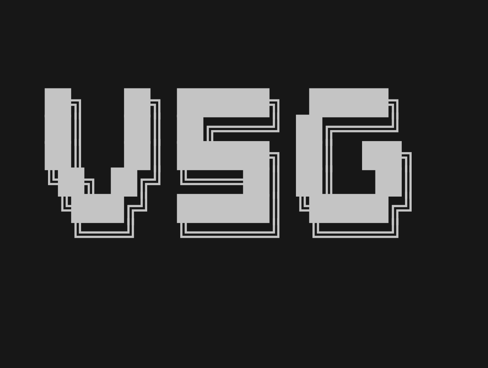

### Hey!
👋 I'm **Vaishnav**.

⚡ An electronics engineering student passionate about **embedded systems development**.

🔧 I work with microcontrollers, build automation tools, and contribute to open-source projects.

🌱 Currently learning Japanese and exploring embedded systems opportunities.

 

#### ⚡ Stats

I joined GitHub **4** years ago and have been actively contributing to open-source projects, building embedded applications, and working with various microcontrollers and development tools.

#### 🚀 Projects

**Rust**
- [Hayasen](https://github.com/Vaishnav-Sabari-Girish/Hayasen) – Embedded Rust crate with sensor support
- [ComChan](https://github.com/Vaishnav-Sabari-Girish/ComChan) – Fast serial monitor for embedded systems
- [Kiroku](https://github.com/Vaishnav-Sabari-Girish/Kiroku) – TUI tool for boolean expressions

**C**
- [Sbor](https://github.com/Vaishnav-Sabari-Girish/sbor) – Build & dependency management tool for C

**C++ (Arduino)**
- [Smart Door Lock using Li-Fi](https://github.com/Vaishnav-Sabari-Girish/Smart_Door_Lock_Using_Li-Fi)
- [Smart Field Monitoring System](https://github.com/Vaishnav-Sabari-Girish/field_monitoring_system)

**Web & Scripting**
- [Portfolio Website](https://vaishnav.world) – HTML/CSS/JS
- [arduino-cli-interactive](https://github.com/Vaishnav-Sabari-Girish/arduino-cli-interactive) – Interactive Arduino CLI wrapper
- [My Gists](https://gist.github.com/Vaishnav-Sabari-Girish/) - Collection of some script I use daily. Main for aesthetics and automation.

#### 🛠️ What am I working on?

|**Category**|**Description**|
|--|--|
|**Building**|Open-source Rust libraries and embedded applications.|
|**Learning**|Japanese language and advanced embedded systems concepts.|
|**Studying**|Final year Electronics Engineering at Jain University.|
|**Contributing**|Open-source embedded development tools and libraries.|
|**Exploring**|Modern embedded development workflows and automation.|
|**Developing**|Cross-platform terminal applications and system utilities.|

#### 💻 Technologies

**Programming Languages:** Rust • C/C++ • Python • Bash  
**Hardware:** STM32 • ESP32 • Nordic Microcontrollers  
**Tools:** Git • Linux • Neovim • KiCad • Docker • TMUX  
**Web:** HTML/CSS • JavaScript • Typst  
**Language Learning:** Japanese (目指せN3!)

#### 🌐 Connect

[🌍 Website](https://vaishnav.world/) • [💼 LinkedIn](https://www.linkedin.com/in/vaishnav-sabari-girish) • [📱 Telegram](https://t.me/vaishnav_dev) • [📝 Blog](https://vaishnav.world/blog) • [🔐 Keyoxide](https://keyoxide.org/aspe:keyoxide.org:UGMJ6VGDFJEOVHF27DC7JD6WMQ)

💖 Open to **embedded systems opportunities for freshers**!

#### 📊 GitHub Stats

**~** *vaishnav.world*
